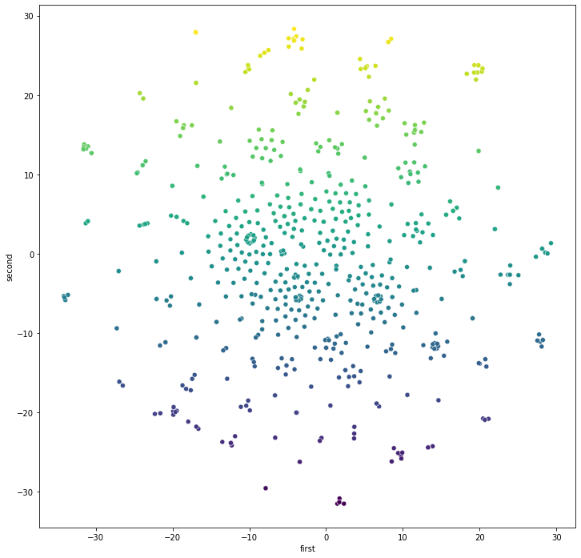
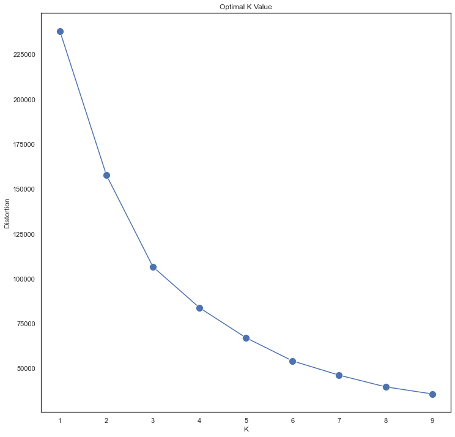

# Cryptocurrency Clusters

## Background

* You are on the Advisory Services Team of a financial consultancy. One of your clients, a prominent investment bank, is interested in offering a new cryptocurrency investment portfolio for its customers. The company, however, is lost in the vast universe of cryptocurrencies. They’ve asked you to create a report that includes what cryptocurrencies are on the trading market and determine whether they can be grouped to create a classification system for this new investment.

* You have been handed raw data, so you will first need to process it to fit the machine learning models. Since there is no known classification system, you will need to use unsupervised learning. You will use several clustering algorithms to explore whether the cryptocurrencies can be grouped together with other similar cryptocurrencies. You will use data visualization to share your findings with the investment bank.

The above chart shows three clear clusters via t-SNE. 

After calculating the optimal k-value (depicted in the chart below), the data grouped into more discrete clusters.
The color scheme helps highlight the discrete clusters.

## Instructions

### Data Preparation

* Read `crypto_data.csv` into Pandas. The dataset was obtained from [CryptoCompare](https://min-api.cryptocompare.com/data/all/coinlist).

* Discard all cryptocurrencies that are not being traded. In other words, filter for currencies that are currently being traded. Once you have done this, drop the `IsTrading` column from the dataframe.

* Remove all rows that have at least one null value.

* Filter for cryptocurrencies that have been mined. That is, the total coins mined should be greater than zero.

* In order for your dataset to be comprehensible to a machine learning algorithm, its data should be numeric. Since the coin names do not contribute to the analysis of the data, delete the `CoinName` from the original dataframe.

* Your next step in data preparation is to convert the remaining features with text values, `Algorithm` and `ProofType`, into numerical data. To accomplish this task, use Pandas to create dummy variables. Examine the number of rows and columns of your dataset now. How did they change?

* Standardize your dataset so that columns that contain larger values do not unduly influence the outcome.

### Dimensionality Reduction

* Creating dummy variables above dramatically increased the number of features in your dataset. Perform dimensionality reduction with PCA. Rather than specify the number of principal components when you instantiate the PCA model, it is possible to state the desired **explained variance**. For example, say that a dataset has 100 features. Using `PCA(n_components=0.99)` creates a model that will preserve approximately 99% of the explained variance, whether that means reducing the dataset to 80 principal components or 3. For this project, preserve 90% of the explained variance in dimensionality reduction. How did the number of the features change?

* Next, further reduce the dataset dimensions with t-SNE and visually inspect the results. In order to accomplish this task, run t-SNE on the principal components: the output of the PCA transformation. Then create a scatter plot of the t-SNE output. Observe whether there are distinct clusters or not.

### Cluster Analysis with k-Means

* Create an elbow plot to identify the best number of clusters. Use a for-loop to determine the inertia for each `k` between 1 through 10. Determine, if possible, where the elbow of the plot is, and at which value of `k` it appears.

### Recommendation

* Based on your findings, make a brief (1-2 sentences) recommendation to your clients. Can the cryptocurrencies be clustered together? If so, into how many clusters? 

## Rubric

[//]: # ([Unit 20 - Unsupervised Machine Learning Homework Rubric - Cryptocurrency Clusters]&#40;https://docs.google.com/document/d/1zhiC8-PtfMknDxYHagsTukryQAJSdXFRWa-aK3W28Vg/edit?usp=sharing&#41;)

[//]: # ()
[//]: # (- - -)

## References

Crypto Coin Comparison Ltd. (2020) Coin market capitalization lists of crypto currencies and prices. Retrieved from [https://www.cryptocompare.com/coins/list/all/USD/1](https://www.cryptocompare.com/coins/list/all/USD/1)

- - -

© 2021 Trilogy Education Services, LLC, a 2U, Inc. brand. Confidential and Proprietary. All Rights Reserved.
